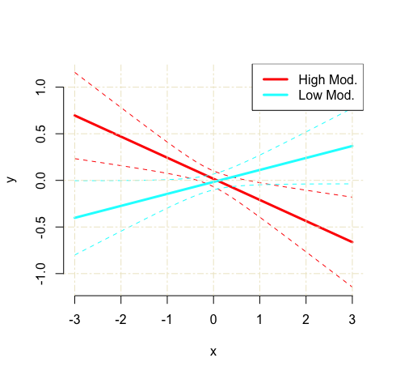
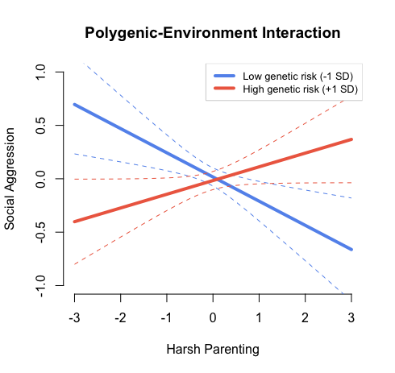

This vignette is to help those who: 
  1. Use a Mac so they cannot create an interaction plot using Mplus, and
  2. Those who want to customize interaction plots using their Mplus output

## Step 1: Create an interaction plot file in Mplus 

Here is example code for doing this using a path model with skewed observed variables and missing data. This can be adapted to other analyses/models as well, see latent variable example [here](https://www.statmodel.com/download/Latent%20variable%20interaction%20LOOP%20plot.pdf).

```mplus

TITLE:	Interaction Plot; 

DATA:	FILE IS data.csv; ! Load data

VARIABLE:	
  NAMES ARE
    id pred mod out; ! Name variables in dataset

  USEVARIABLES ARE
    pred mod out; ! Choose variables that will be included in model

  Missing are all (-99); ! Specify what value indicates missing data
  idvariable = id; ! Specify which variable refers to participant ID if relevant

ANALYSIS: estimator = mlr; ! This specifies that the model will estimate sem model using full information maximum likelihood with robust standard errors

DEFINE: ! Standardize or center variables, then create an interaction term
  STANDARDIZE pred mod;
  pred_mod = pred*mod;

MODEL: ! Specify the model and label the predictor as b1, moderator as b2, and interaction as b3
  out on 
	  pred (b1)
	  mod (b2)
	  pred_mod (b3)
	  ;
	
 pred mod pred_mod; ! Allow predictors to covary and estimate missing data

OUTPUT:
  TECH1 tech4;
  STANDARDIZED CINTERVAL;

MODEL CONSTRAINT: ! Specify your plot (here variables are standardized so 1 is equavalent to 1 SD)
  PLOT(lowmod highmod);
  LOOP(pred,-2,2,0.1); ! x-axis will show predictor between + and - 2 SDs at 0.1 increments 
  lowmod = (b1+b3*(-1))*pred+b2*(-1); ! Plot line at 1 SD below the mean of the moderator
  highmod = (b1+b3*(+1))*pred+b2*(+1); ! Plot line at 1 SD above the mean of the moderator

PLOT: TYPE IS PLOT2;
	
```
Running this code should automatically create a .gh5 file in the folder your code is saved.

## Step 2: Load source code file into R

- Download this file from Mplus I've edited to allow more plot customizations: [mplus2023.r](https://github.com/erinnacland/erinnacland.github.io/blob/main/mplus2023.r) (download button is in top right corner)
- Open R
- In the "Code" dropdown menu from the toolbar, select "Source File..."
- Choose the mplus2023.r file

## Step 3: Plot your graph

Use the "mplus.plot.loop" function to create your graph: provide the .gh5 file created from Mplus and the names of the plot lines you created for low and high moderation values.

```
mplus.plot.loop('/Location/filename.gh5',
	c("lowmod", "highmod")
	)
```
This should spit out a graph that looks like this:



## Step 4: Customize your graph

To add a title use `title` and grid lines can be toggled on via `showgrid` (options: T or F)

For the axes:
- Add axis labels to your plot with `ylab` and `xlab`
- The limits of the y-axis can be set with `ylim`
- Changing the x-axis limits requires altering the Mplus syntax: ```LOOP(pred,-2,2,0.1)```

For the legend: 
- Alter the legend text use `leg.txt`
- Move legend location use `leg.loc` (options: "top", "topleft", "topright", "bottom", "bottomleft", "bottomright")
- Change the size of the text use `leg.cex`
- Set the colour of the legend box border `leg.b.col`

For the lines:
- Change line width with `lwid`
- Confidence interval line types with `linetypes` (options: “blank”, “solid”, “dashed”,“dotted”, “dotdash”, “longdash”, “twodash”). You can also specify a number here to fully control the line gaps (e.g., c("24","24") or c("1223","1223"))

```
mplus.plot.loop('/Users/Location/filename.gh5', 
		c("lowmod", "highmod"),
		title = "Polygenic-Environment Interaction", # Plot title
		ylab = "Social Aggression", # y-axis label
		xlab = "Harsh Parenting", # x-axis label
		ylim = c(-1,1), # y-axis value limits
		leg.txt = c("Low genetic risk (-1 SD)","High genetic risk (+1 SD)"), # Legend caption labels
		leg.loc="topright", # Location of the legend
		leg.cex = .8, # Size of legend text
		leg.b.col = "lightgray", # Colour of legend box outline
		linecolors = c("cornflowerblue","coral2"), # Color of regression lines
		lwid = 4, # Regression lines width
		linetype = c("dashed","dashed") # line type for confidence interval lines (“blank”, “solid”, “dashed”,“dotted”, “dotdash”, “longdash”, “twodash”) 
		showgrid = F, # Show grid lines (T or F) 
                )
```

These specifications should create a plot that looks like this:



Author: [Erinn Acland](https://erinnacland.weebly.com/)
